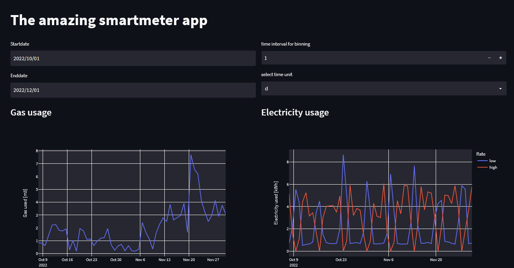

# Smartmeter

This application automates the reading of a smartmeter and displays the output on a Streamlit dashboard.

## 0. Prerequisites

### Hardware
- Raspberry pi (or any constantly running (single board) computer), with USB port.
- Access to LAN only required if frontend must be accessible through the network.
- P1 smartmeter cable to connect from RJ11 port on smartmeter to USB on Raspberry pi.
- Tested on: raspberry pi 3b+, KFM5KAIFA smartmeter

### Software
- Create python virtual environment, eg *util-env* with `python -m venv util-env` 
- In *util-env*: `pip install -r requirements.txt`
- others?

## 1. Set up smartmeter data reading and storage

- adjust *root_config* file to local settings
- activate python environment and run `python ./src/create-db.py` 
- make *./read-meter.sh* executable with `sudo chmod +x read-meter.sh`
- run `crontab-e` 
- add executing *./read-meter.sh* to crontab with desired frequency, and adjust ROOT to local settings, eg:

 `*/5 * * * * ROOT="/home/beerm/projects/utilities" && bash ${ROOT}/read-meter.sh -r $ROOT >> ${ROOT}/logs/cron.log 2>&1`

- run `sudo systemctl restart cron`
	
## 2. Set up smartmeter application
Setup api & frontend as service
- make *./start-server.sh* and *./start-frontend.sh* executable with `sudo chmod +x start-server.sh`
- change `ROOT` in *smartmeter-server.service* and *smartmeter-frontend.service* to local settings
- copy *services/smartmeter-server.service* and *services/smartmeter-frontend.service* to /etc/systemd/system
- run `sudo systemctl enable smartmeter-server.service`
- run `sudo systemctl enable smartmeter-frontend.service`
- reboot
- check status with `sudo systemctl status smartmeter-server.service` 
